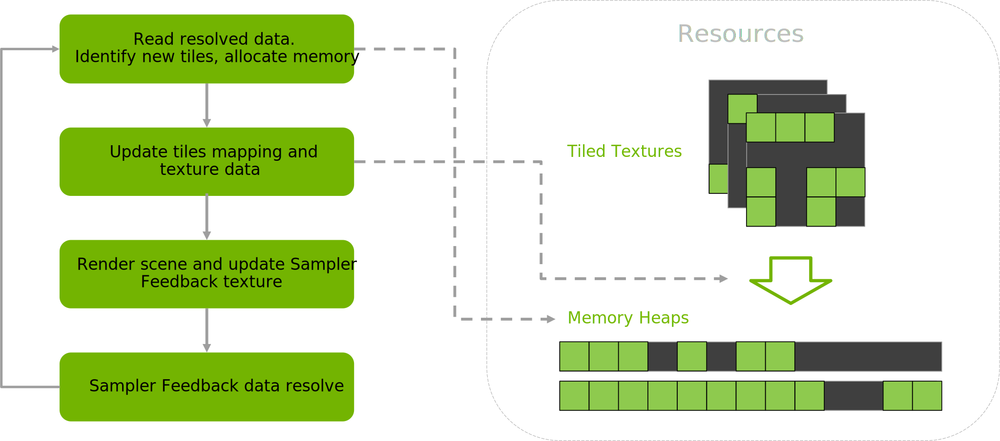
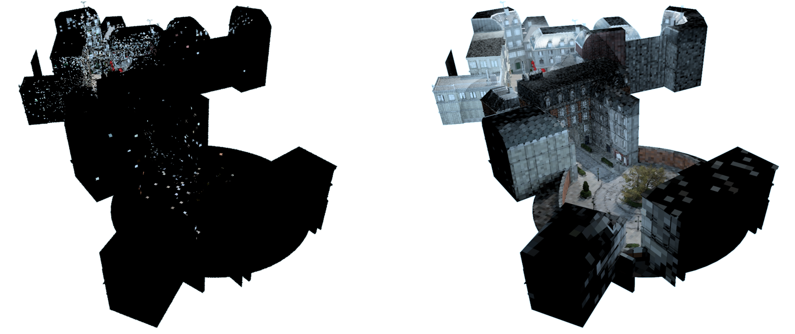

# RTXTS Integration Guide

The RTXTS library requires the application to create all streamed textures using the Direct3D12 reserved resource type. To ensure reliable fallback when textures are used, it is recommended to always allocate and map packed mip levels. The library can be configured to follow this logic.

A typical texture streaming pipeline operates as follows:

* Read resolved data, identify new tiles, and allocate memory*
* Update tile mappings and texture data
* Render the scene and update the `Sampler Feedback` texture
* Resolve `Sampler Feedback` data

*This pass depends on having resolved sampler feedback data on the CPU and should be executed asynchronously to prevent explicit synchronization between the CPU and GPU

<figure align="center">

<figcaption>Figure 1. Texture streaming loop</figcaption>
</figure>

The RTXTS library handles the initial two passes, other passes should be implemented using the application's render abstraction

## API

### Resource Management

For each tiled texture, we generate an integer identifier using `AddStreamedTexture()` that will be assosiated with the resource. The library doesn't instantiate a physical D3D resource; instead, it prepares all the necessary data to efficiently manage resource tiles. Additionally, it offers helper function to obtain texture descriptor parameters for an actual Sampler Feedback resource creation and a `MinMip` texture parameters. The latter is used to guarantee accurate data sampling where only resident tiles are touched.

```C++
void rtxts::StreamedTextureManager::AddStreamedTexture(const TiledTextureDesc& tiledTextureDesc, uint32_t& textureId);
```

### Render Flow

The application is responsible for modifying the shaders that access texture data. For tiled textures, a specialized `Sample()` function is used, which includes an extra `status` parameter. This parameter indicates whether every value from a `Sample()` operation has been retrieved from mapped tiles in a tiled resource. The `status` is verified using the `CheckAccessFullyMapped()` function. If this function returns false, we must determine the optimal texture level to sample from that contains all the necessary tiles mapped. For that we can utilize a dedicated `MinMip` texture; alternatively, we can traverse down the mip pyramid to locate the closest level with resident tiles. It is crucial to ensure that at least the final mip level is mapped and contains the necessary data to prevent visual artifacts.

After acquiring the data, we must also record sampler feedback information for the original sample. This step is crucial for keeping our texture cache in an active state with all the data needed for rendering. We accomplish this using the `WriteSamplerFeedback()` function. Since each write operation involves additional data processing overhead, we can reduce that by using stochastic writes, which only operate on a relatively small number of texture accesses while still ensuring nearly complete sample coverage over multiple frames.

Typically, a uniform probability is applied to all material samples. However, if albedo textures offer the most visual impact, their feedback can be prioritized for more immediate responsiveness. Additionally, incorporating the framerate can help ensure consistent sample coverage over a specified time window.

In each frame, we must read back the sampler feedback data through a two-step process. The first step converts the data from its internal opaque format and writes it to a buffer in a standard layout, while the second step asynchronously reads from that buffer to identify which tiles were accessed. Once the data is available on the CPU, we call `UpdateWithSamplerFeedback()` for each texture being processed. It’s important to note that resolving sampler feedback data and performing readbacks incurs overhead, so limiting these operations per frame may be beneficial. This strategy allows textures to be processed in a round-robin fashion, with only a fixed subset handled each frame. After the sampler feedback data is copied back, we can clear sampler feedback textures content. For optimal performance, both the copying and clearing operations should be executed in batches.

```C++
void rtxts::StreamedTextureManager::UpdateWithSamplerFeedback(uint32_t textureId, SamplerFeedbackDesc& samplerFeedbackDesc, uint32_t timeStamp, uint32_t timeout);
```

After updating the internal state with `UpdateWithSamplerFeedback()` call, we retrieve a list of unnecessary tiles by calling `GetTilesToUnmap()`.

```C++
void rtxts::StreamedTextureManager::GetTilesToUnmap(uint32_t textureId, std::vector<TileType>& tileIndices);
```

Tiles that no longer need to be mapped should be updated using `ID3D12CommandQueue::UpdateTileMappings()`, as their underlying memory is already freedmarked as available for reuse by other tiles.

After that, we transition to the newly identified tiles, which require both memory mapping and texture data updates. To do this, we start with `GetTilesToMap()` to retrieve a list of new tiles to process for each texture. For each texture processed in the current frame, we record the data and send a request to an external system to prepare the texture data for the new tiles. Only once this data becomes available we call `UpdateTilesMapping()` to update the internal state, which is then reflected in the MinMip data.

```C++
void rtxts::StreamedTextureManager::GetTilesToMap(uint32_t textureId, std::vector<TileType>& tileIndices);
void rtxts::StreamedTextureManager::UpdateTilesMapping(uint32_t textureId, std::vector<TileType>& tileIndices);
```

### Memory Management

To create a `Streamed Texture Manager`, you need to fill an underlying descriptor that controls the allocation granularity for physical heaps and implements the `HeapAllocator()` interface class.

```C++
struct StreamedTextureManagerDesc
{
    bool alwaysMapPackedTiles = true;
    HeapAllocator* pHeapAllocator = nullptr;
    uint32_t heapTilesCapacity = 256; // number of 64KB tiles per heap, controls allocation granularity
};
```

```C++
class HeapAllocator
{
public:
    virtual ~HeapAllocator() {};

    virtual void AllocateHeap(uint64_t heapSizeInBytes, uint32_t& heapId) = 0;
    virtual void ReleaseHeap(uint32_t heapId) = 0;
};
```

The RTXTS library manages memory allocations by invoking `AllocateHeap()` and `ReleaseHeap()` via `rtxts::HeapAllocator`. After `ReleaseHeap()` is called, the application may choose to delay the physical memory release and keep it available for a while to prevent potential stalls from rapid memory deallocation and allocation.

## Performance

* Batch resolve and clear calls for feedback textures
* Prefer using ID3D12GraphicsCommandList::DiscardResource() over ID3D12GraphicsCommandList::ClearUnorderedAccessViewUint() to clear feedback textures
* Optimize texture usage by batching sets associated with the same material, as multiple textures can share feedback data
* For passes with ray tracing texture LODs ideally should be aligned with rasterization. Naive texture mip selection defaulting to level 0 can result in inefficient data streaming

<figure align="center">

<figcaption>Image 1. Scene regions covered by path tracer using one frame(left) and over multiple frames(right)</figcaption>
</figure>